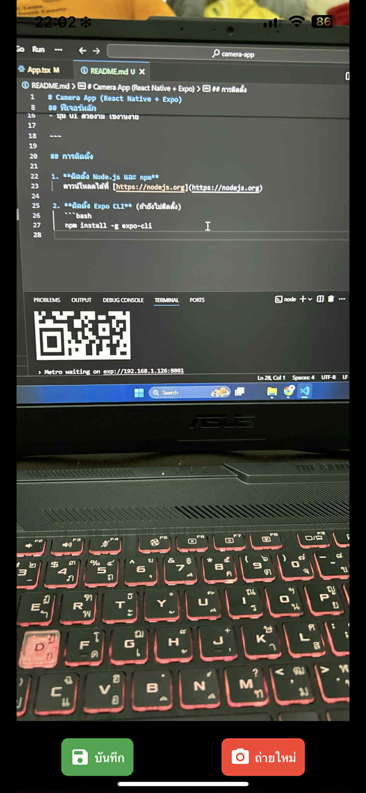
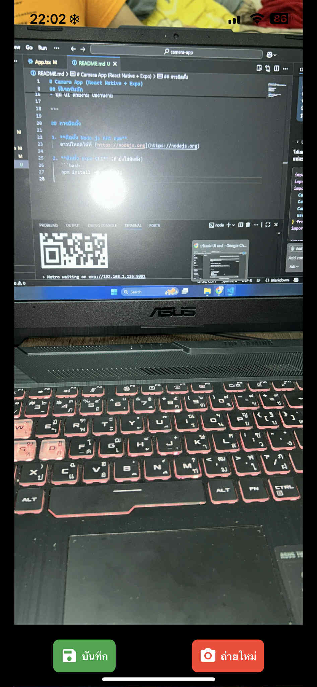

# Camera App (React Native + Expo)

โปรเจกต์นี้เป็นแอปกล้องสำหรับมือถือที่พัฒนาด้วย **React Native และ Expo**  
รองรับการถ่ายรูป, สลับกล้องหน้า-หลัง, เปิด/ปิดแฟลช และบันทึกรูปภาพลงคลังรูปภาพ

---

## ฟีเจอร์หลัก

- ขออนุญาตเข้าถึงกล้องและคลังรูปภาพ
- ถ่ายรูปด้วยกล้องหน้าและกล้องหลัง
- เปิด/ปิดแฟลช
- ดูตัวอย่างรูปภาพก่อนบันทึก
- บันทึกรูปภาพลงคลังรูปภาพ
- ถ่ายใหม่ได้หากไม่พอใจรูปภาพ
- ปุ่ม UI สวยงาม ใช้งานง่าย

---

## การติดตั้ง

1. **ติดตั้ง Node.js และ npm**  
   ดาวน์โหลดได้ที่ [https://nodejs.org](https://nodejs.org)

2. **ติดตั้ง Expo CLI** (ถ้ายังไม่ติดตั้ง)
   ```bash
   npm install -g expo-cli

---

## ตัวอย่างหน้าจอ (Screenshots)

ด้านล่างนี้คือตัวอย่างหน้าจอของแอปพลิเคชันเมื่อทำงาน

### หน้าจอถ่ายภาพ
![หน้าจอถ่ายภาพ]
*หน้าจอสำหรับถ่ายภาพ มีปุ่มสลับกล้อง, ถ่ายภาพ, และเปิด/ปิดแฟลช*

### หน้าจอแสดงตัวอย่างและบันทึก

*หลังจากถ่ายภาพ จะแสดงตัวอย่างพร้อมตัวเลือกให้บันทึกหรือถ่ายใหม่*

---
